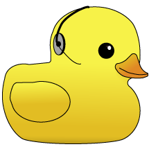

<!-- BEGIN TOP -->

# Kiwi Pilot Sandbox: DeNepo

> 

> 
Tech Support

>
> 
>
>  

- [Study Board](https://github.com/DeNepo/kiwi-pilot-sandbox/projects/2)
- People
  - [Learners](#learners) -
    [Randomizer](https://DeNepo.github.io/kiwi-pilot-sandbox/randomizer)
  - [Coaches](#coaches)
  - [Admins](#admins)
- Class Notes
  - [Vocabulary](./vocabulary)
    (_[PRs](https://github.com/DeNepo/kiwi-pilot-sandbox/pulls?q=label%3Avocabulary)_)
  - [Snippets](./snippets)
    (_[PRs](https://github.com/DeNepo/kiwi-pilot-sandbox/pulls?q=label%3Asnippets)_)
  - [Cheat Sheets](./cheat-sheets)
  - [Chill Zone](./chill-zone.md)
- [Guides](./guides)
  - [Study Tips](./guides/study-tips)
  - [Class Workflows](./guides/class-workflows)
  - [Planning and Collaborating](https://github.com/DeNepo/planning-and-collaborating)

---

<!-- END TOP -->

<!-- BEGIN MODULES -->

## Modules

Take your first steps into collaborative programming.

### [0. Precourse.](https://github.com/DeNepo/precourse): 1 week

> [check-ins](https://github.com/DeNepo/kiwi-pilot-sandbox/issues/?q=milestone%3A"0.%20Precourse."+label%3Acheck-in)
> |
> [deliverables board](https://github.com/orgs/DeNepo/projects/2/views/1?filterQuery=milestone%3A"0.%20Precourse."+label%3Adeliverable)
> |
> [retros](https://github.com/DeNepo/kiwi-pilot-sandbox/issues/?q=milestone%3A"0.%20Precourse."+label%3Aretro+label%3Acheck-in)
> || [milestone](https://github.com/DeNepo/kiwi-pilot-sandbox/milestone/1)

Set up your development environment and GitHub account, then find your way
around this repository so you're ready to roll on day 1.

- **Deliverables**:
  [listed in the module repository](https://github.com/DeNepo/precourse/tree/main/deliverables)

### [1. Workflows](https://github.com/DeNepo/workflows): 1 week

> [check-ins](https://github.com/DeNepo/kiwi-pilot-sandbox/issues/?q=milestone%3A"1.%20Workflows"+label%3Acheck-in)
> |
> [deliverables board](https://github.com/orgs/DeNepo/projects/2/views/1?filterQuery=milestone%3A"1.%20Workflows"+label%3Adeliverable)
> |
> [retros](https://github.com/DeNepo/kiwi-pilot-sandbox/issues/?q=milestone%3A"1.%20Workflows"+label%3Aretro+label%3Acheck-in)
> || [milestone](https://github.com/DeNepo/kiwi-pilot-sandbox/milestone/2)

Learn the workflows you need to develop individually and in a group.

- **Week 1**: Chapters 0, 1, 2, 3 - _Local/remote workflows for **individual and
  collaborative development**._ - **Individual Deliverable**:
  [Student Bio PR](https://github.com/DeNepo/workflows/blob/main/deliverables/student-bio-pr.md) -
  **Collaborative Deliverable**:
  [Group Intro Repo](https://github.com/DeNepo/workflows/blob/main/deliverables/group-introduction-repo.md)

### [2. Agile Development](https://github.com/DeNepo/agile-development): 2 weeks

> [check-ins](https://github.com/DeNepo/kiwi-pilot-sandbox/issues/?q=milestone%3A"2.%20Agile%20Development"+label%3Acheck-in)
> |
> [deliverables board](https://github.com/orgs/DeNepo/projects/2/views/1?filterQuery=milestone%3A"2.%20Agile%20Development"+label%3Adeliverable)
> |
> [retros](https://github.com/DeNepo/kiwi-pilot-sandbox/issues/?q=milestone%3A"2.%20Agile%20Development"+label%3Aretro+label%3Acheck-in)
> || [milestone](https://github.com/DeNepo/kiwi-pilot-sandbox/milestone/3)

Practice collaboratively planning and developing HTML/CSS websites.

- **Week 1**: Chapters 0, 1 - Following Plans
  - Lesson Plan:
    [Planning and Collaborating](https://github.com/DeNepo/agile-development/blob/master/lesson-plans/planning-and-collaborating.md)
  - Deliverable:
    [All About Trees](https://github.com/DeNepo/agile-development/blob/master/deliverables/all-about-trees)
- **Week 2**: Chapter 2 - Writing Plans
  - Lesson Plan:
    [User-Centered Development](https://github.com/DeNepo/agile-development/blob/master/lesson-plans/user-centered-development.md)
  - Deliverable:
    [Loruki Rebuild](https://github.com/DeNepo/agile-development/blob/master/deliverables/loruki-rebuild.md)
- **Break Week!**
- **Week 3**: Chapter 3 - Adapting Plans
  - Lesson Plan:
    [Being Agile](https://github.com/DeNepo/agile-development/blob/master/lesson-plans/being-agile.md)
  - Deliverable: Begin
    [HYF Redesign](https://github.com/DeNepo/agile-development/blob/master/deliverables/hyf-redesign.md)

### [3. UX/UI Design](https://github.com/DeNepo/ux-ui-design): 3 weeks

> [check-ins](https://github.com/DeNepo/kiwi-pilot-sandbox/issues/?q=milestone%3A"3.%20UX%2FUI%20Design"+label%3Acheck-in)
> |
> [deliverables board](https://github.com/orgs/DeNepo/projects/2/views/1?filterQuery=milestone%3A"3.%20UX%2FUI%20Design"+label%3Adeliverable)
> |
> [retros](https://github.com/DeNepo/kiwi-pilot-sandbox/issues/?q=milestone%3A"3.%20UX%2FUI%20Design"+label%3Aretro+label%3Acheck-in)
> || [milestone](https://github.com/DeNepo/kiwi-pilot-sandbox/milestone/4)

Explore design thinking process and placing your users at the center of your
development process.

- **Week 1**: Chapter 1
  - Lesson Plan:
    [Design Thinking](https://github.com/DeNepo/ux-ui-design/blob/master/lesson-plans/design-thinking.md)
  - Deliverable:
    [Practical Case](https://github.com/DeNepo/ux-ui-design/blob/master/deliverables/practical-case.md)
- **Week 2**: Chapters 2, 3
  - Lesson Plan:
    [Gestalt Principles & Figma](https://github.com/DeNepo/ux-ui-design/blob/master/lesson-plans/gestalt-and-figma.md)
  - Deliverable:
    [Co-Design your Home Page](https://github.com/DeNepo/ux-ui-design/blob/master/deliverables/co-design-your-home-page)
- **Week 3**: Chapter 4 - Accessibility
  - Lesson Plan: TBD
  - Deliverable: A fully accessible portfolio page co-developed with classmates.

### [4. Component Based Design with Next.js](): 1 week

> [check-ins](https://github.com/DeNepo/kiwi-pilot-sandbox/issues/?q=milestone%3A"4.%20Component-Based%20Design%20with%20Next.js"+label%3Acheck-in)
> |
> [deliverables board](https://github.com/orgs/DeNepo/projects/2/views/1?filterQuery=milestone%3A"4.%20Component-Based%20Design%20with%20Next.js"+label%3Adeliverable)
> |
> [retros](https://github.com/DeNepo/kiwi-pilot-sandbox/issues/?q=milestone%3A"4.%20Component-Based%20Design%20with%20Next.js"+label%3Aretro+label%3Acheck-in)
> || [milestone](https://github.com/DeNepo/kiwi-pilot-sandbox/milestone/5)

Learn to build static pages with component-based design & Next.js.

### [5. Client Facing Project](): 4 weeks

> [check-ins](https://github.com/DeNepo/kiwi-pilot-sandbox/issues/?q=milestone%3A"5.%20Client-Facing%20Project"+label%3Acheck-in)
> |
> [deliverables board](https://github.com/orgs/DeNepo/projects/2/views/1?filterQuery=milestone%3A"5.%20Client-Facing%20Project"+label%3Adeliverable)
> |
> [retros](https://github.com/DeNepo/kiwi-pilot-sandbox/issues/?q=milestone%3A"5.%20Client-Facing%20Project"+label%3Aretro+label%3Acheck-in)
> || [milestone](https://github.com/DeNepo/kiwi-pilot-sandbox/milestone/6)

We find real (or mock) clients for teams of 2-3 learners to build a landing page
for. These can be individuals, businesses, non-profits, ... TBD

---

<!-- END MODULES -->

<!-- BEGIN LEARNERS -->

## Learners

|  | <h3 id="octocat">Octocat</h3> [octocat](https://github.com/octocat) \| [home page](https://octocat.github.io) \| [bio](./student-bios/octocat.md) [help wanted](https://github.com/DeNepo/kiwi-pilot-sandbox/discussions/categories/help-wanted?discussions_q=author%3Aoctocat+category%3Ahelp-wanted+is:unanswered) \| [questions](https://github.com/DeNepo/kiwi-pilot-sandbox/discussions/categories/question?discussions_q=author%3Aoctocat+category%3AQ%26A+is:unanswered) \| [all discussions](https://github.com/DeNepo/kiwi-pilot-sandbox/discussions/categories/question?discussions_q=includes%3Aoctocat) [check-ins](https://github.com/DeNepo/kiwi-pilot-sandbox/issues/?q=assignee%3Aoctocat+label%3Acheck-in) \| [deliverables](https://github.com/orgs/DeNepo/projects/2/views/1?filterQuery=assignee%3Aoctocat+label%3Adeliverable) \| [retros](https://github.com/DeNepo/kiwi-pilot-sandbox/issues/?q=assignee%3Aoctocat+label%3Aretro+label%3Acheck-in) [opened](https://github.com/DeNepo/kiwi-pilot-sandbox/issues?q=author%3Aoctocat) \| [assigned](https://github.com/DeNepo/kiwi-pilot-sandbox/issues?q=assignee%3Aoctocat) \| [commented](https://github.com/DeNepo/kiwi-pilot-sandbox/issues?q=commenter%3Aoctocat) \| [mentioned](https://github.com/DeNepo/kiwi-pilot-sandbox/issues?q=mentions%3Aoctocat) |
| -------------------------------------------------------------------------------------------------- | ------------------------------------------------------------------------------------------------------------------------------------------------------------------------------------------------------------------------------------------------------------------------------------------------------------------------------------------------------------------------------------------------------------------------------------------------------------------------------------------------------------------------------------------------------------------------------------------------------------------------------------------------------------------------------------------------------------------------------------------------------------------------------------------------------------------------------------------------------------------------------------------------------------------------------------------------------------------------------------------------------------------------------------------------------------------------------------------------------------------------------------------------------------------------------------------------------------------------------------------------------------------------------------------------------------------------------------------------- |

Octocat's github stats

 

---

<!-- END LEARNERS -->

<!-- BEGIN COACHES -->

## Coaches

<table><tr><th>  </th><th> <h3 id="nurabunamus">Nur</h3> <a href="https://github.com/nurabunamus">nurabunamus</a> | <a href="https://github.com/DeNepo/kiwi-pilot-sandbox/discussions?discussions_q=involves%3Anurabunamus">discussions</a> <a href="https://github.com/DeNepo/kiwi-pilot-sandbox/issues?q=author%3Anurabunamus">opened</a> | <a href="https://github.com/DeNepo/kiwi-pilot-sandbox/issues?q=assignee%3Anurabunamus">assigned</a> | <a href="https://github.com/DeNepo/kiwi-pilot-sandbox/issues?q=commenter%3Anurabunamus">commented</a> | <a href="https://github.com/DeNepo/kiwi-pilot-sandbox/issues?q=mentions%3Anurabunamus">mentioned</a>  </th></tr></table>

<table><tr><th>  </th><th> <h3 id="yoshimalaise">Yoshi</h3> <a href="https://github.com/yoshimalaise">yoshimalaise</a> | <a href="https://github.com/DeNepo/kiwi-pilot-sandbox/discussions?discussions_q=involves%3Ayoshimalaise">discussions</a> <a href="https://github.com/DeNepo/kiwi-pilot-sandbox/issues?q=author%3Ayoshimalaise">opened</a> | <a href="https://github.com/DeNepo/kiwi-pilot-sandbox/issues?q=assignee%3Ayoshimalaise">assigned</a> | <a href="https://github.com/DeNepo/kiwi-pilot-sandbox/issues?q=commenter%3Ayoshimalaise">commented</a> | <a href="https://github.com/DeNepo/kiwi-pilot-sandbox/issues?q=mentions%3Ayoshimalaise">mentioned</a>  </th></tr></table>

<table><tr><th>  </th><th> <h3 id="unmeshvrije">Unmesh</h3> <a href="https://github.com/unmeshvrije">unmeshvrije</a> | <a href="https://github.com/DeNepo/kiwi-pilot-sandbox/discussions?discussions_q=involves%3Aunmeshvrije">discussions</a> <a href="https://github.com/DeNepo/kiwi-pilot-sandbox/issues?q=author%3Aunmeshvrije">opened</a> | <a href="https://github.com/DeNepo/kiwi-pilot-sandbox/issues?q=assignee%3Aunmeshvrije">assigned</a> | <a href="https://github.com/DeNepo/kiwi-pilot-sandbox/issues?q=commenter%3Aunmeshvrije">commented</a> | <a href="https://github.com/DeNepo/kiwi-pilot-sandbox/issues?q=mentions%3Aunmeshvrije">mentioned</a>  </th></tr></table>

<table><tr><th>  </th><th> <h3 id="colevandersWands">Evan</h3> <a href="https://github.com/colevandersWands">colevandersWands</a> | <a href="https://github.com/DeNepo/kiwi-pilot-sandbox/discussions?discussions_q=involves%3AcolevandersWands">discussions</a> <a href="https://github.com/DeNepo/kiwi-pilot-sandbox/issues?q=author%3AcolevandersWands">opened</a> | <a href="https://github.com/DeNepo/kiwi-pilot-sandbox/issues?q=assignee%3AcolevandersWands">assigned</a> | <a href="https://github.com/DeNepo/kiwi-pilot-sandbox/issues?q=commenter%3AcolevandersWands">commented</a> | <a href="https://github.com/DeNepo/kiwi-pilot-sandbox/issues?q=mentions%3AcolevandersWands">mentioned</a>  </th></tr></table>

---

<!-- END COACHES -->

<!-- BEGIN ADMINS -->

## Admins

|  | <h3 id="ahmed-azzam">Ahmed</h3> Operational Director   [ahmed-azzam](https://github.com/ahmed-azzam) \| <a href="https://github.com/DeNepo/kiwi-pilot-sandbox/discussions?discussions_q=involves%3Aahmed-azzam">discussions</a> [opened](https://github.com/DeNepo/kiwi-pilot-sandbox/issues?q=author%3Aahmed-azzam) \| [assigned](https://github.com/DeNepo/kiwi-pilot-sandbox/issues?q=assignee%3Aahmed-azzam) \| [commented](https://github.com/DeNepo/kiwi-pilot-sandbox/issues?q=commenter%3Aahmed-azzam) \| [mentioned](https://github.com/DeNepo/kiwi-pilot-sandbox/issues?q=mentions%3Aahmed-azzam) |
| ---------------------------------------------------------------------------------------------------------- | ------------------------------------------------------------------------------------------------------------------------------------------------------------------------------------------------------------------------------------------------------------------------------------------------------------------------------------------------------------------------------------------------------------------------------------------------------------------------------------------------------------------------------------------------------------------------------------------------------------------------- |

|  | <h3 id="octocat">Octocat</h3> South Gaza Coordinator   [octocat](https://github.com/octocat) \| <a href="https://github.com/DeNepo/kiwi-pilot-sandbox/discussions?discussions_q=involves%3Aoctocat">discussions</a> [opened](https://github.com/DeNepo/kiwi-pilot-sandbox/issues?q=author%3Aoctocat) \| [assigned](https://github.com/DeNepo/kiwi-pilot-sandbox/issues?q=assignee%3Aoctocat) \| [commented](https://github.com/DeNepo/kiwi-pilot-sandbox/issues?q=commenter%3Aoctocat) \| [mentioned](https://github.com/DeNepo/kiwi-pilot-sandbox/issues?q=mentions%3Aoctocat) |
| -------------------------------------------------------------------------------------------------- | --------------------------------------------------------------------------------------------------------------------------------------------------------------------------------------------------------------------------------------------------------------------------------------------------------------------------------------------------------------------------------------------------------------------------------------------------------------------------------------------------------------------------------------------------------------------------------------------- |

|  | <h3 id="colevandersWands">Evan</h3> PIlot Coordinator   [colevandersWands](https://github.com/colevandersWands) \| <a href="https://github.com/DeNepo/kiwi-pilot-sandbox/discussions?discussions_q=involves%3AcolevandersWands">discussions</a> [opened](https://github.com/DeNepo/kiwi-pilot-sandbox/issues?q=author%3AcolevandersWands) \| [assigned](https://github.com/DeNepo/kiwi-pilot-sandbox/issues?q=assignee%3AcolevandersWands) \| [commented](https://github.com/DeNepo/kiwi-pilot-sandbox/issues?q=commenter%3AcolevandersWands) \| [mentioned](https://github.com/DeNepo/kiwi-pilot-sandbox/issues?q=mentions%3AcolevandersWands) |
| -------------------------------------------------------------------------------------------------------------------- | ------------------------------------------------------------------------------------------------------------------------------------------------------------------------------------------------------------------------------------------------------------------------------------------------------------------------------------------------------------------------------------------------------------------------------------------------------------------------------------------------------------------------------------------------------------------------------------------------------------------------------------------------------------- |

---

<!-- END ADMINS -->
